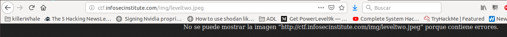

# Infosec Institute CTF


**Write Up for [Infosec Institute n00bs CTF](http://ctf.infosecinstitute.com/index.php).**


 - [Infosec Institute CTF](#infosec-institute-ctf)
   - [level 1](#level-1)
   - [level 2](#level-2)
   - [level 3](#level-3)
   - [level 4](#level-4)
   - [level 5](#level-5)
   - [level 6](#level-6)
   - [level 7](#level-7)
   - [level 8](#level-8)
   - [level 9](#level-9)
   - [level 10](#level-10)
   - [level 11](#level-11)
   - [level 12](#level-12)
   - [level 13](#level-13)
   - [level 14](#level-14)
   - [level 15](#level-15)


## level 1

May the source be with you!

Checking page source code the flag can be found inside a comment

`infosec_flagis_welcome`

## level 2

This level gives an error when loaded: 
**It seems like the image is broken..Can you check the file?**

Cheking the image in browser, you can confirm that the file exists but has "errors"



Trying to get the file with *curl* gives you interesting information

```bash
curl http://ctf.infosecinstitute.com/img/leveltwo.jpeg
aW5mb3NlY19mbGFnaXNfd2VhcmVqdXN0c3RhcnRpbmc=
```
Decoding the response you get the flag

```bash
echo "aW5mb3NlY19mbGFnaXNfd2VhcmVqdXN0c3RhcnRpbmc=" | base64 -d
```
`infosec_flagis_wearejuststarting`

## level 3


## level 4

## level 5

## level 6

## level 7

## level 8

## level 9

## level 10

## level 12

## level 12

## level 13

## level 14

## level 15


